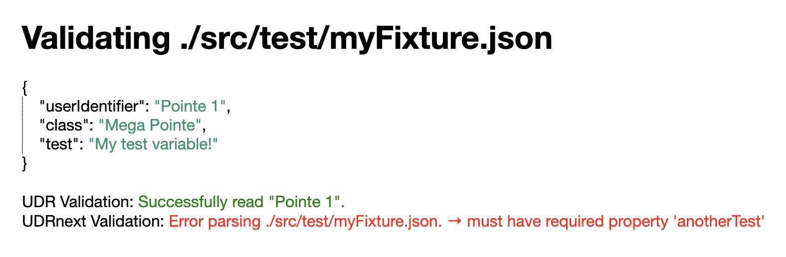

# Definition Validation

This proof-of-concept shows how definition files (`Documents`) can be easily validated against their respective spec (`Schema`). Currently this only implements `UDR` but can be further extended in the future.

