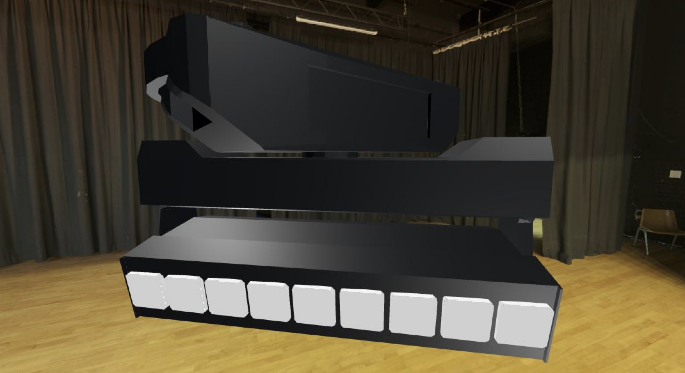

# Visualizer

This proof-of-concept shows an environment ([World](https://oshifty.github.io/vision/classes/World.html)) build with [three.js](https://threejs.org). Upon load it fetches a fixture model from GDTF Share and loads it into the environment to be visualized. The poc currently supports Pan / Tilt Attributes only and a very limited selection of fixtures but it can be extended easily in the future. It comes with a remote that is implemented over [here](/src/routes/visualizer/remote).

[dev server link](/visualizer)

